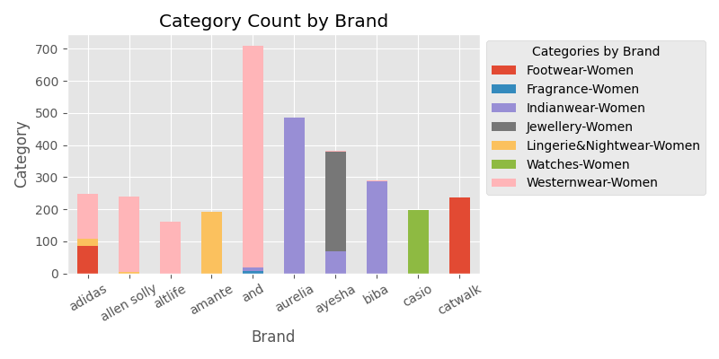

# Exploratory Data Analysis - Product DataSet
### Data Preparation
After Product Dataset is loaded, initial data exploration is conducted. We get information about given columns and their data types:

```
RangeIndex: 4566 entries, 0 to 4565
Data columns (total 11 columns):
 #   Column        Non-Null Count  Dtype 
---  ------        --------------  ----- 
 0   S.No          4566 non-null   int64 
 1   BrandName     4566 non-null   object
 2   Product ID    4566 non-null   object
 3   Product Name  4566 non-null   object
 4   Brand Desc    4566 non-null   object
 5   Product Size  4566 non-null   object
 6   Currancy      4566 non-null   object
 7   MRP           4553 non-null   object
 8   SellPrice     4566 non-null   int64 
 9   Discount      4566 non-null   object
 10  Category      4566 non-null   object
dtypes: int64(2), object(9)
memory usage: 231.9+ KB
```
Since the column names follow different naming conventions, some of them are renamed. Then dataset is checked for Nan values in inappropriate places and for duplicate rows:
```
S.No             0
Brand_Name       0
Product_ID       0
Product_Name     0
Brand_Desc       0
Product_Size     0
Currancy         0
MRP             13
Sell_Price       0
Discount         0
Category         0
dtype: int64
```

MRP stands for Maximum retail price, so there can be some NaN values in this column, but this will be changed in the next step. No duplicate columns were found.

After looking at the variations of values in each column, three columns were identified that needed some cleanup in order to conduct further analysis:
1) Discount column was transformed to contain only the numerical value of percentage.
2) In Product_Size column 'Size:' prefixes were removed from some rows and 'Nan' string was replaced by NaN value.
3) In MRP column some of the values had different types so they were all transformed into float, NaN values were interpreted as if Sell_Price equals to MRP.

### Data Summary
Since we have Sell_Price and Discount it would be useful to see statisicts of actual prices, so a new colunm Actual_Price that combined Sell_Prices and Discounts was added. Additionally, it would be interesting to note the differences between MRP and Sell_Price columns, so a new colunm 'Diff_MRP_Price' was added. 

After data preparation, summary of numerical features was obtained:
```
              S.No           MRP    Sell_Price     Discount  Actual_Price  \
count  4566.000000   4553.000000   4566.000000  4566.000000   4566.000000
mean   2283.500000   2416.316934   2005.222733    29.991897   1559.355184
std    1318.234994   2554.005880   2259.614915    17.856129   1973.356653
min       1.000000      0.000000     89.000000     5.000000     26.700000
25%    1142.250000    999.000000    749.000000    10.000000    467.400000
50%    2283.500000   1799.000000   1379.000000    30.000000    899.400000
75%    3424.750000   2799.000000   2299.000000    50.000000   1804.050000
max    4566.000000  28495.000000  25995.000000    80.000000  23395.500000

       Diff_MRP_Price
count     4553.000000
mean       406.675599
std       1371.789392
min     -11630.000000
25%          0.000000
50%        420.000000
75%        860.000000
max      11498.000000
```

### Univariate analysis

Let's analyze the columns individually:
1) There are three columns with unique values: S. No, Product_ID, Product_Name.
2) There is a column with the same value in every row: Currency.
3) There are two columns that are not relevant to the analysis: Brand Desc (since its values are almost unique), Product Size (since its values are not standardized).
4) This leaves us with five columns: Brand_Name, MRP, Sell_Pricece, Discount, Category.

For columns MRP, Sell_Pricece, Discount we already acquired some knowledge about their value distributions (e.g. mean and median values) in the dataset summary. So now we can analyze the remaining two columns: Brand_Name and Category.

For the column Brand_Name, Brand-wise analysis is conducted and the top ten brands with the most products are identified. This data is visualized with a horizontal bar chart.


For the column Categories, Category-wise analysis is conducted and the distribution of products by categories is identified. This data is visualized with a pie chart. 


### Multivariate analysis

First, let's identify overall pricing trends and strategies. 
For that we can look at corelation between Sell_Price and Discount with Categories.


Additionally, we can look at corelation between MRT, Sell_Price and Actual_Price by Category and identify categories with the biggest markup.


Secondly, let's explore top 10 brands that were identified earlier.
For that we can look at stacked bar chart of categories by brands.



In order to identify brand specific pricing patterns, we can look at the differences between Actual_Prices by categories. 


